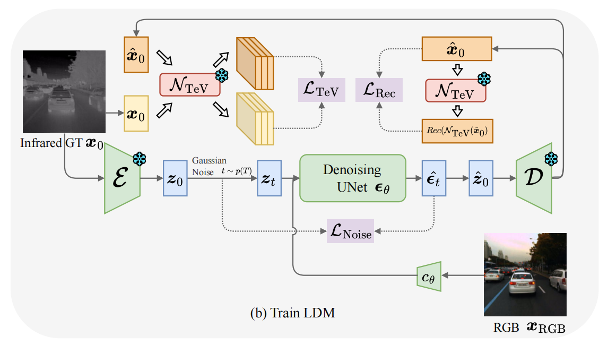

# PID: Physics-Informed Diffusion Model for Infrared Image Generation



## Environment

We recommend you to install the environment with environment.yaml. 

```bash
conda env create --file=environment.yaml
```

## Datasets

Download KAIST dataset from https://github.com/SoonminHwang/rgbt-ped-detection.

Download FLIR dataset from https://www.flir.com/oem/adas/adas-dataset-form/.

## Checkpoint

VQGAN can be downloaded from https://github.com/CompVis/latent-diffusion.

|  Name  |                   Note                   |                             Link                             |
| :----: | :--------------------------------------: | :----------------------------------------------------------: |
| TeVNet | TeVNet checkpoint for KAIST, epoch=0.95k | [TeVNet_KAIST.zip](https://1drv.ms/u/s!AiBcDdKjVk0ubr49dgvt-R5s6jM?e=7hpRLS) |
| TeVNet |   TeVNet checkpoint for FLIR, epoch=1k   | [TeVNet_FLIR.zip](https://1drv.ms/u/s!AiBcDdKjVk0ubV_nT3EIDnzJ10Y?e=bQeXc4) |
|  PID   |  PID checkpoint for KAIST, k1=50, k2=5   | [PID_KAIST.zip](https://1drv.ms/u/s!AiBcDdKjVk0ub0BI3aQGHxxQf-g?e=6LlzBE) |
|  PID   |    PID checkpoint for FLIR, k1=k2=50     | [PID_FLIR.zip](https://1drv.ms/u/s!AiBcDdKjVk0ucJF2M7FwuVhJoiU?e=Hfm2B9) |

## Evaluation

Use the shellscript to evaluate. `indir` is the input directory of visible RGB images, `outdir` is the output directory of translated infrared images, `config` is the chosen config in `configs/latent-diffusion/config.yaml`.  We prepare some RGB images in `dataset/KAIST` for quick evaluation.

```sh
bash run_test_kaist512_vqf8.sh
```

## Train

### Dataset preparation

Prepare corresponding RGB and infrared images with same names in two directories.

### Stage 1: Train TeVNet

```bash
cd TeVNet
python prepare.py
bash shell/run.sh
```

### Stage 2: Train PID

Use the shellscript to train. It is recommended to use our pretrained model to accelerate the train process.

```bash
bash shell/run_train_kaist512_vqf8.sh
```

## Acknowledgements

Our code is built upon [LDM](https://github.com/CompVis/latent-diffusion) and [HADAR](https://github.com/FanglinBao/HADAR). We thank the authors for their excellent work.